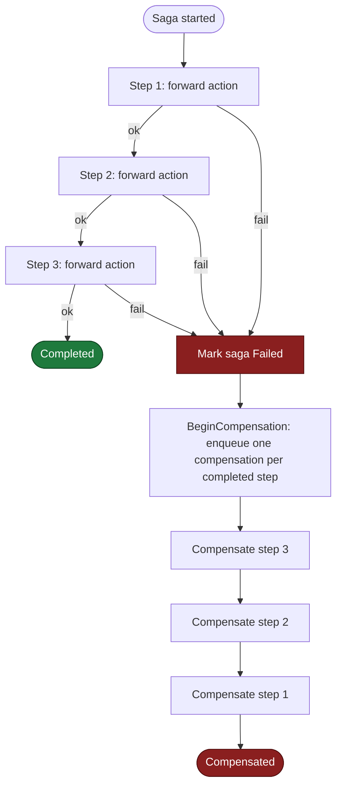

# dotnet-saga-orchestrator

A .NET library for coordinating distributed business transactions with the **saga** pattern. It runs a
sequence of steps across multiple services and, when one step fails, automatically undoes the work already
done by running the matching compensating transactions - in reverse. The result is eventual consistency
without distributed locks or two-phase commit.

## What is a saga (and an orchestrator)?

A single business operation - "place an order", "book a trip", "transfer money" - often spans several
independent services, each with its own database. There is no shared transaction that can commit or roll
back all of them at once. A **saga** models that operation as an ordered list of local steps. Each step has
two sides:

- a **forward action** (charge the card, reserve inventory, book the flight), and
- a **compensating action** that semantically undoes it (refund the card, release the inventory, cancel the
  flight).

If every step succeeds, the saga completes. If a step fails, the saga is marked failed and the compensations
for the steps that already completed are executed, typically in **reverse order** (the last completed step is
compensated first). Compensation is *semantic*, not a byte-for-byte rollback: you cannot un-send an email, but
you can send a cancellation.

There are two common ways to drive a saga:

- **Choreography** - each service listens for events and decides what to do next. No central coordinator.
- **Orchestration** - a single coordinator tells each service what to do and reacts to the result.

This library implements the **orchestration** style. A `SagaOrchestrationService` owns the state machine,
persists progress after every step, and delegates rollback to a `CompensationService`. That makes the flow
easy to reason about, trace, and test - at the cost of a central component you must keep available.

## Compensation flow



Forward steps run top to bottom; the moment any of them fails the saga flips into the compensation phase and
unwinds the completed steps bottom to top. The order is controlled by `CompensationStrategy`
(default `ReverseOrder`).

## Quickstart

Register the services with dependency injection:

```csharp
using Microsoft.Extensions.DependencyInjection;
using SagaOrchestrator.Configuration;

var services = new ServiceCollection();
services.AddSagaOrchestrator(); // in-memory repositories by default
var provider = services.BuildServiceProvider();
```

## Runnable example

The snippet below defines a three-step order saga, creates an instance, and drives it to completion. It uses
only public API and the in-memory repositories, so it runs as-is against the library.

```csharp
using Microsoft.Extensions.DependencyInjection;
using SagaOrchestrator.Application.Services;
using SagaOrchestrator.Configuration;
using SagaOrchestrator.Core.Domain.Enums;
using SagaOrchestrator.Core.Domain.Models;

var provider = new ServiceCollection()
    .AddSagaOrchestrator()
    .BuildServiceProvider();

var definitions = provider.GetRequiredService<SagaDefinitionService>();
var orchestrator = provider.GetRequiredService<SagaOrchestrationService>();

// 1. Describe the workflow: each step names its forward URL and its compensation URL.
var definition = await definitions.CreateDefinitionAsync(
    "OrderProcessing", "Charge, reserve, then ship an order");

await definitions.AddStepAsync(definition.Id, new SagaStepDefinition(
    "ProcessPayment", "payment-service",
    "http://payment/charge", "http://payment/refund"));

await definitions.AddStepAsync(definition.Id, new SagaStepDefinition(
    "ReserveInventory", "inventory-service",
    "http://inventory/reserve", "http://inventory/release"));

await definitions.AddStepAsync(definition.Id, new SagaStepDefinition(
    "ScheduleShipping", "shipping-service",
    "http://shipping/schedule", "http://shipping/cancel"));

var stored = await definitions.GetDefinitionAsync(definition.Id);

// 2. Instantiate and start the saga.
var saga = await orchestrator.CreateSagaAsync(stored, maxRetries: 3, timeoutSeconds: 120);
await orchestrator.StartSagaAsync(saga.Id);

// 3. Execute steps until none remain. On failure the orchestrator flips the saga
//    into compensation and unwinds completed steps in reverse order.
SagaStep? step;
while ((step = await orchestrator.ExecuteNextStepAsync(saga.Id)) != null)
{
    Console.WriteLine($"{step.Name}: {step.Status}");
}

var final = await orchestrator.GetSagaAsync(saga.Id);
Console.WriteLine($"Saga finished with status: {final.Status}");

// If the saga had failed, drive compensation to completion:
if (final.Status == SagaStatus.Failed)
{
    var compensated = await orchestrator.CompensateSagaAsync(saga.Id);
    Console.WriteLine($"After compensation: {compensated.Status}"); // Compensated
}
```

More end-to-end scenarios (money transfer, travel booking, advanced retries, metrics) live under
[`examples/`](examples/), and design rationale is recorded in [`docs/adr/`](docs/adr/).

---

<!-- The sections below are auto-generated per-type reference documentation. -->

## EnumExtensions

The `EnumExtensions` static class provides a comprehensive set of extension methods for handling and manipulating enums. It simplifies tasks like retrieving descriptions and display names, parsing strings to enums, performing flag checks, and navigating enum values.

### Usage Example

```csharp
using System.ComponentModel;
using System.ComponentModel.DataAnnotations;
using SagaOrchestrator.Core.Extensions;

public enum Status
{
    [Description("Pending Approval")]
    Pending,
    [Display(Name = "In Progress")]
    Processing,
    Completed
}

[Flags]
public enum Permissions
{
    Read = 1,
    Write = 2,
    Execute = 4
}

// Get descriptions and display names
var status = Status.Pending;
Console.WriteLine(status.GetDescription()); // Pending Approval
Console.WriteLine(Status.Processing.GetDisplayName()); // In Progress

// Parse strings
var parsed = "Completed".ParseEnum<Status>(); // Status.Completed

// Get all values and names
var values = EnumExtensions.GetValues<Status>(); // [Pending, Processing, Completed]
var names = EnumExtensions.GetNames<Status>(); // ["Pending", "Processing", "Completed"]

// Get dictionary
var dict = EnumExtensions.GetEnumDictionary<Status>();

// Check definition and navigate
Console.WriteLine(Status.Pending.IsDefined()); // True
Console.WriteLine(status.GetNext()); // Processing
Console.WriteLine(status.GetPrevious()); // Completed

// Get numeric value
Console.WriteLine(status.GetNumericValue()); // 0

// Flags and range
var perms = Permissions.Read | Permissions.Write;
Console.WriteLine(perms.HasAnyFlag(Permissions.Read)); // True
Console.WriteLine(EnumExtensions.IsFlagsEnum<Permissions>()); // True
Console.WriteLine(perms.FormatFlags()); // "Read, Write"
var range = EnumExtensions.GetRange<Status>(); // (Pending, Completed)

// Get from numeric value
var fromValue = EnumExtensions.GetEnumFromValue<Status>(1); // Status.Processing
```


## StringExtensions

The `StringExtensions` static class provides a comprehensive set of extension methods for string manipulation and validation. These utilities simplify common string operations like checking for null/empty, case conversions, substring counting, and formatting.

### Usage Example

```csharp
using SagaOrchestrator.Core.Extensions;

var originalString = "  Hello World  ";
var trimmedString = originalString.Trim();
var isEmpty = string.IsNullOrEmpty(trimmedString); // False

// Check if null/empty/whitespace
Console.WriteLine(originalString.IsNullOrEmpty()); // False
Console.WriteLine(originalString.IsNullOrWhiteSpace()); // True
Console.WriteLine("".IsNullOrEmpty()); // True
Console.WriteLine("   ".IsNullOrWhiteSpace()); // True

// Convert to title/camel/snake/kebab case
Console.WriteLine("helloWorld".ToTitleCase()); // HelloWorld
Console.WriteLine("HelloWorld".ToCamelCase()); // helloWorld
Console.WriteLine("HelloWorld".ToSnakeCase()); // hello_world
Console.WriteLine("HelloWorld".ToKebabCase()); // hello-world

// Truncate and append ellipsis
Console.WriteLine("This is a very long string".Truncate(10)); // This is a...

// Count occurrences of substring
Console.WriteLine("hello world, hello universe".CountOccurrences("hello")); // 2

// Remove prefix/suffix
Console.WriteLine("https://example.com/path".RemovePrefix("https://")); // example.com/path
Console.WriteLine("example.txt".RemoveSuffix(".txt")); // example

// Validate email and URL
Console.WriteLine("user@example.com".IsValidEmail()); // True
Console.WriteLine("https://example.com".IsValidUrl()); // True

// Create slug
Console.WriteLine("Hello World!".ToSlug()); // hello-world

// Repeat string
Console.WriteLine("abc".Repeat(3)); // abcabcabc

// Split and trim
Console.WriteLine("  a,  b,   c  ".SplitAndTrim(',').Length); // 3

// Null if empty
Console.WriteLine("".NullIfEmpty()); // 
Console.WriteLine("test".NullIfEmpty()); // test
```

## SagaStepDefinition

The `SagaStepDefinition` class defines the configuration and behavior of a step in a saga workflow. It encapsulates all necessary parameters for executing a step, including service endpoints, timeout and retry configurations, compensation logic, and metadata for custom orchestration behaviors.

### Usage Example

```csharp
using SagaOrchestrator.Core.Domain.Models;
using SagaOrchestrator.Core.Utilities;

// Create a basic step definition
var step = new SagaStepDefinition(
    "Process Payment",
    "PaymentService",
    "https://payments.example.com/api/process",
    "https://payments.example.com/api/compensate"
);

step.Description = "Process customer payment transaction";
step.Order = 1;
step.TimeoutSeconds = 60;
step.MaxRetries = 5;
step.RetryDelayMilliseconds = 2000;
step.IsAsync = true;
step.HttpMethod = "POST";

// Configure compensation
step.SetCompensable(true, "https://payments.example.com/api/compensate");

// Set custom retry policy
step.SetRetryPolicy(new RetryPolicy(
    maxRetries: 3,
    initialDelayMs: 1000,
    maxDelayMs: 10000,
    backoffMultiplier: 2.0,
    jitterFactor: 0.1
));

// Add metadata
step.Metadata.Add("circuitBreakerThreshold", "3");
step.Metadata.Add("requiresTransaction", "true");

// Validate configuration
bool isValid = step.Validate();

// Adjust timeout dynamically
step.SetTimeout(30);
```

## SagaStep

The `SagaStep` class represents a single execution instance of a step within a saga workflow. It tracks the runtime state of an individual step, including its status, execution timing, retry attempts, payloads, and responses. Each `SagaStep` instance is created from a `SagaStepDefinition` when a saga is instantiated, and its lifecycle is managed by the `SagaOrchestrationService` as the saga executes.

### Usage Example

```csharp
using SagaOrchestrator.Core.Domain.Models;
using SagaOrchestrator.Core.Domain.Enums;

// Create a new saga step instance (typically done by the orchestrator)
var step = new SagaStep();

// Initialize with required parameters
step.Initialize(
    name: "Process Payment",
    order: 1,
    serviceUrl: "https://payments.example.com/api/charge",
    compensationUrl: "https://payments.example.com/api/refund"
);

// Set additional properties
step.SagaId = "saga-12345";
step.SetPayload(new Dictionary<string, object>
{
    { "paymentId", "pay-789" },
    { "amount", 150.00 },
    { "customerId", "cust-456" }
});
step.MaxRetries = 5;
step.TimeoutSeconds = 60;

// Start execution
step.Start();

// Simulate successful completion
var response = new Dictionary<string, object>
{
    { "transactionId", "txn-123" },
    { "status", "completed" },
    { "timestamp", DateTime.UtcNow }
};
step.Complete(response);

// Check status and timing
Console.WriteLine($"Step status: {step.Status}"); // Completed
Console.WriteLine($"Started at: {step.StartedAt}");
Console.WriteLine($"Completed at: {step.CompletedAt}");
Console.WriteLine($"Execution took: {(step.CompletedAt - step.StartedAt)?.TotalSeconds} seconds");

// If the saga fails later, the step can be compensated
// step.Compensate();

// Check if step can be retried
if (step.CanRetry())
{
    step.PrepareForRetry();
    Console.WriteLine($"Retry count: {step.RetryCount}"); // 1
}

// If step fails
// step.Fail("Payment service unavailable", response);
```

## SagaDefinition

The `SagaDefinition` class defines the structure and configuration of a saga workflow. It serves as a blueprint for creating saga instances, containing metadata about the saga (name, description, version) and the ordered list of steps that make up the workflow. The definition supports validation, step lookup by name or order, and configurable compensation strategies for handling failures.

### Usage Example

```csharp
using SagaOrchestrator.Core.Domain.Models;
using SagaOrchestrator.Core.Domain.Enums;

// Create a new saga definition
var definition = new SagaDefinition(
    "OrderProcessingSaga",
    "Processes a customer order through payment, inventory, and shipping"
);

definition.Description = "Handles complete order lifecycle with compensation support";
definition.Version = 2;
definition.IsActive = true;
definition.CompensationStrategy = CompensationStrategy.ReverseOrder;

// Add steps to the definition
var paymentStep = new SagaStepDefinition(
    "ProcessPayment",
    "PaymentService",
    "https://payments.example.com/api/charge",
    "https://payments.example.com/api/refund"
);
var inventoryStep = new SagaStepDefinition(
    "ReserveInventory",
    "InventoryService",
    "https://inventory.example.com/api/reserve",
    "https://inventory.example.com/api/release"
);
var shippingStep = new SagaStepDefinition(
    "ScheduleShipping",
    "ShippingService",
    "https://shipping.example.com/api/schedule",
    "https://shipping.example.com/api/cancel"
);

definition.AddStep(paymentStep);
definition.AddStep(inventoryStep);
definition.AddStep(shippingStep);

// Validate the definition
bool isValid = definition.Validate();
Console.WriteLine($"Definition is valid: {isValid}");

// Look up steps by name or order
var paymentDefinition = definition.GetStepByName("ProcessPayment");
var firstStep = definition.GetStepByOrder(1);

// Create a new definition from an existing one (copy constructor pattern)
var newDefinition = new SagaDefinition
{
    Id = definition.Id,
    Name = definition.Name,
    Description = definition.Description,
    Version = definition.Version + 1,
    Steps = new List<SagaStepDefinition>(definition.Steps),
    CreatedAt = DateTime.UtcNow,
    IsActive = definition.IsActive,
    CompensationStrategy = definition.CompensationStrategy
};
```

## SagaStepDebugState

The `SagaStepDebugState` record captures an immutable snapshot of a single saga step's execution state at a specific point in time. It is used by the distributed debugger to represent individual steps within a `SagaDebugSnapshot`, enabling time-travel inspection and analysis of saga execution history.

### Usage Example

```csharp
using SagaOrchestrator.Core.Domain.Models;
using SagaOrchestrator.Core.Domain.Enums;

// Create a SagaStepDebugState representing a completed step
var completedStepState = new SagaStepDebugState
{
    StepId = "step-001",
    StepName = "Process Payment",
    StepOrder = 1,
    Status = SagaStepStatus.Completed,
    RetryCount = 0,
    MaxRetries = 3,
    StartedAt = DateTime.UtcNow.AddSeconds(-10),
    CompletedAt = DateTime.UtcNow,
    CompensatedAt = null,
    ErrorMessage = null,
    ServiceUrl = "https://payments.example.com/api/process",
    OutputData = new Dictionary<string, object>
    {
        { "paymentId", "pay-12345" },
        { "amount", 99.99 },
        { "status", "completed" }
    }
};

// Create a SagaStepDebugState representing a failed step
var failedStepState = new SagaStepDebugState
{
    StepId = "step-002",
    StepName = "Send Notification",
    StepOrder = 2,
    Status = SagaStepStatus.Failed,
    RetryCount = 1,
    MaxRetries = 3,
    StartedAt = DateTime.UtcNow.AddSeconds(-5),
    CompletedAt = null,
    CompensatedAt = null,
    ErrorMessage = "Notification service unavailable",
    ServiceUrl = "https://notifications.example.com/api/send",
    OutputData = new Dictionary<string, object>
    {
        { "recipient", "user@example.com" },
        { "message", "Order confirmation" }
    }
};

// Use FromStep factory method to create from a live step
var liveStep = new SagaStep(
    id: "step-003",
    name: "Inventory Check",
    order: 3,
    serviceUrl: "https://inventory.example.com/api/check"
);
var stepState = SagaStepDebugState.FromStep(liveStep);
```

### Usage Example

```csharp
using SagaOrchestrator.Core.Extensions;

// Create a deadline 2 hours from now
var deadline = DateTime.UtcNow.AddHours(2);

// Check if deadline has expired
Console.WriteLine(deadline.IsExpired()); // False
Console.WriteLine(DateTime.UtcNow.AddMinutes(-5).IsExpired()); // True

// Calculate remaining time until deadline
var remaining = deadline.TimeUntil();
Console.WriteLine($"Time remaining: {remaining.FormatDuration()}"); // Time remaining: 2 hours

// Calculate elapsed time since start
var start = DateTime.UtcNow.AddMinutes(-15);
var elapsed = start.ElapsedSince();
Console.WriteLine($"Elapsed: {elapsed.FormatDuration()}"); // Elapsed: 15 minutes

// Round down to specific time units
var now = DateTime.UtcNow;
Console.WriteLine(now.RoundDownToSecond()); // Current time rounded to nearest second
Console.WriteLine(now.RoundDownToMinute()); // Current time rounded to nearest minute
Console.WriteLine(now.RoundDownToHour()); // Current time rounded to nearest hour

// Check if date is within range
var rangeStart = DateTime.UtcNow.AddDays(-1);
var rangeEnd = DateTime.UtcNow.AddDays(1);
Console.WriteLine(now.IsWithinRange(rangeStart, rangeEnd)); // True

// Convert to ISO 8601 and Unix timestamp
Console.WriteLine(now.ToIso8601String()); // 2025-07-15T12:34:56.789Z
Console.WriteLine(now.ToUnixTimestamp()); // 1752544496

// Convert back from Unix timestamp
var fromTimestamp = DateTimeExtensions.FromUnixTimestamp(1752544496);
Console.WriteLine(fromTimestamp); // 2025-07-15T12:34:56Z

// Add business days (excludes weekends)
var monday = new DateTime(2025, 7, 14); // Monday
Console.WriteLine(monday.AddBusinessDays(3)); // 2025-07-17 (Thursday)
Console.WriteLine(monday.AddBusinessDays(5)); // 2025-07-21 (Monday)

// Get start/end of time periods
Console.WriteLine(now.StartOfDay()); // Today at 00:00:00
Console.WriteLine(now.EndOfDay()); // Today at 23:59:59.9999999
Console.WriteLine(now.StartOfMonth()); // First day of month at 00:00:00
Console.WriteLine(now.EndOfMonth()); // Last day of month at 23:59:59.9999999
Console.WriteLine(now.StartOfYear()); // January 1st at 00:00:00
Console.WriteLine(now.EndOfYear()); // December 31st at 23:59:59.999

// Format time spans
var duration = TimeSpan.FromMinutes(90);
Console.WriteLine(duration.FormatDuration()); // 1 hours

// Measure execution time
var executionTime = DateTimeExtensions.Measure(() => {
    Thread.Sleep(100);
});
Console.WriteLine($"Execution took: {executionTime.TotalMilliseconds}ms");

// Relative time formatting
Console.WriteLine(DateTime.UtcNow.AddMinutes(-2).ToRelativeTime()); // 2 minutes ago
Console.WriteLine(DateTime.UtcNow.AddHours(-1).ToRelativeTime()); // 1 hours ago
```

## CompensationTransaction

The `CompensationTransaction` class represents a compensating transaction that undoes a completed saga step, enabling rollback and eventual consistency in distributed transactions. It tracks the compensation lifecycle including status, retry attempts, timeouts, and payloads for both the original request and compensation response.

### Usage Example

```csharp
using SagaOrchestrator.Core.Domain.Models;
using SagaOrchestrator.Core.Domain.Enums;

// Create a new compensation transaction
var compensation = new CompensationTransaction();

// Initialize with saga and step information
compensation.Initialize(
    sagaId: "saga-12345",
    stepId: "step-payment-processing",
    stepName: "Process Payment",
    order: 2,
    compensationUrl: "https://payments.example.com/api/compensate"
);

// Set the original request payload
compensation.SetRequestPayload(new Dictionary<string, object>
{
    { "paymentId", "pay-789" },
    { "amount", 150.00 },
    { "customerId", "cust-456" },
    { "orderId", "ord-101" }
});

// Start the compensation
compensation.Start();

// Simulate compensation call (in real usage this would call the CompensationUrl)
var responsePayload = new Dictionary<string, object>
{
    { "compensationId", "comp-999" },
    { "status", "refunded" },
    { "refundAmount", 150.00 }
};

// Complete successfully
compensation.Complete(responsePayload);

// Or handle failure
// compensation.Fail("Payment service unavailable", responsePayload);

// Check status
Console.WriteLine($"Compensation Status: {compensation.Status}"); // CompensationStatus.Completed
Console.WriteLine($"Completed at: {compensation.CompletedAt}");
Console.WriteLine($"Retry count: {compensation.RetryCount}/{compensation.MaxRetries}");
```

## SagaEvent

The `SagaEvent` class represents domain events emitted during saga execution. It serves as an audit trail and monitoring mechanism that captures lifecycle events, step executions, and errors with associated metadata. Events can be filtered by severity and correlated to specific sagas or steps for debugging and observability purposes.

### Usage Example

```csharp
using SagaOrchestrator.Core.Domain.Models;
using SagaOrchestrator.Core.Domain.Enums;

// Create a lifecycle event for saga creation
var sagaCreatedEvent = new SagaEvent
{
    SagaId = "saga-001",
    EventType = "Lifecycle",
    EventName = "SagaCreated",
    Description = "Order processing saga initialized",
    Severity = EventSeverity.Information,
    Source = "SagaOrchestrator"
};

// Add custom data to the event
sagaCreatedEvent.AddData("orderId", "ORD-12345");
sagaCreatedEvent.AddData("customerId", "CUST-789");

// Create a step execution event
var stepExecutedEvent = SagaEvent.CreateStepEvent(
    sagaId: "saga-001",
    stepId: "step-payment-001",
    stepName: "Process Payment",
    eventName: "PaymentCompleted",
    description: "Successfully charged customer credit card"
);

// Add step-specific data
stepExecutedEvent.AddData("paymentId", "PAY-45678");
stepExecutedEvent.AddData("amount", 99.99);
stepExecutedEvent.AddData("transactionId", "TXN-999");

// Create an error event
var errorEvent = SagaEvent.CreateErrorEvent(
    sagaId: "saga-001",
    stepName: "ReserveInventory",
    errorMessage: "Inventory service returned 404: Item not available"
);

// Add error-specific data
errorEvent.AddData("itemId", "ITM-555");
errorEvent.AddData("requestedQuantity", 10);

// Access event properties
Console.WriteLine($"Event: {errorEvent.EventName}"); // ExecutionError
Console.WriteLine($"Severity: {errorEvent.Severity}"); // Error
Console.WriteLine($"Timestamp: {errorEvent.Timestamp}");
Console.WriteLine($"Data count: {errorEvent.Data.Count}"); // 2
```

## ValidationExtensions

The `ValidationExtensions` static class provides a comprehensive set of extension methods for parameter validation using a fluent API. These utilities simplify common validation patterns like null checks, range validation, string length constraints, email/URL validation, and collection validation in a clean, chainable way.

### Usage Example

```csharp
using SagaOrchestrator.Core.Extensions;

// Validate method parameters with fluent syntax
public void ProcessOrder(
    string customerEmail,
    int quantity,
    DateTime deadline,
    List<string> items,
    decimal discountRate)
{
    // Null checks
    customerEmail.NotNullOrEmpty(nameof(customerEmail))
        .ValidateEmail(nameof(customerEmail));
    
    // Range validation
    quantity.InRange(1, 100, nameof(quantity));
    discountRate.InRange(0, 1, nameof(discountRate));
    
    // Time validation
    deadline.GreaterThan(DateTime.UtcNow, nameof(deadline));
    TimeSpan.FromHours(2).GreaterThanZero(nameof(deadline));
    
    // Collection validation
    items.NotEmpty(nameof(items));
    
    // Guid validation
    var orderId = Guid.NewGuid();
    orderId.NotEmpty(nameof(orderId));
    
    // Array validation
    var tags = new string[] { "urgent", "priority" };
    tags.NotEmptyArray(nameof(tags));
    
    // Dictionary validation
    var metadata = new Dictionary<string, string> { { "key", "value" } };
    metadata.NotEmptyDictionary(nameof(metadata));
    
    // Conditional validation
    var optionalValue = "test@example.com";
    optionalValue.ValidateIf(
        v => v.IsValidEmail(),
        "Optional value must be a valid email if provided");
    
    // String length constraints
    var username = "user123";
    username.MinLength(5, nameof(username))
        .MaxLength(20, nameof(username));
    
    // URL validation
    var callbackUrl = "https://example.com/api/callback";
    callbackUrl.ValidateUrl(nameof(callbackUrl));
}

// ... existing ValidationExtensions usage example ...

// Example usage
ProcessOrder(
    "user@example.com",
    5,
    DateTime.UtcNow.AddHours(1),
    new List<string> { "item1", "item2" },
    0.15m);
```

## EnumExtensions

The `EnumExtensions` static class provides a comprehensive set of extension methods for handling and manipulating enums. It simplifies tasks like retrieving descriptions and display names, parsing strings to enums, performing flag checks, and navigating enum values.

### Usage Example

```csharp
using System.ComponentModel;
using System.ComponentModel.DataAnnotations;
using SagaOrchestrator.Core.Extensions;

public enum Status
{
    [Description("Pending Approval")]
    Pending,
    [Display(Name = "In Progress")]
    Processing,
    Completed
}

[Flags]
public enum Permissions
{
    Read = 1,
    Write = 2,
    Execute = 4
}

// Get descriptions and display names
var status = Status.Pending;
Console.WriteLine(status.GetDescription()); // Pending Approval
Console.WriteLine(Status.Processing.GetDisplayName()); // In Progress

// Parse strings
var parsed = "Completed".ParseEnum<Status>(); // Status.Completed

// Get all values and names
var values = EnumExtensions.GetValues<Status>(); // [Pending, Processing, Completed]
var names = EnumExtensions.GetNames<Status>(); // ["Pending", "Processing", "Completed"]

// Get dictionary
var dict = EnumExtensions.GetEnumDictionary<Status>();

// Check definition and navigate
Console.WriteLine(Status.Pending.IsDefined()); // True
Console.WriteLine(status.GetNext()); // Processing
Console.WriteLine(status.GetPrevious()); // Completed

// Get numeric value
Console.WriteLine(status.GetNumericValue()); // 0

// Flags and range
var perms = Permissions.Read | Permissions.Write;
Console.WriteLine(perms.HasAnyFlag(Permissions.Read)); // True
Console.WriteLine(EnumExtensions.IsFlagsEnum<Permissions>()); // True
Console.WriteLine(perms.FormatFlags()); // "Read, Write"
var range = EnumExtensions.GetRange<Status>(); // (Pending, Completed)

// Get from numeric value
var fromValue = EnumExtensions.GetEnumFromValue<Status>(1); // Status.Processing
```

