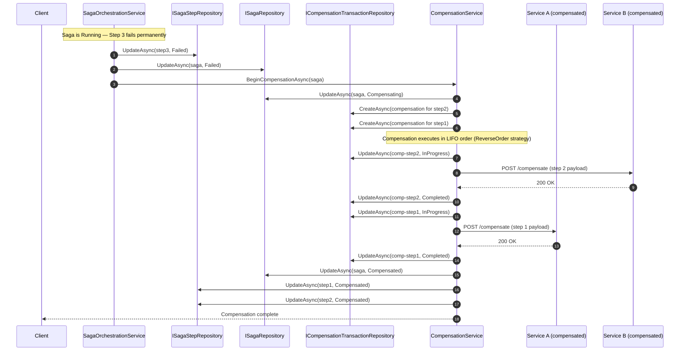

# Compensation Flow

This document explains how the compensation flow works when a multi-step saga partially fails,
including ordering guarantees, failure-in-compensation handling, and the design decisions behind
the implementation.

---

## Overview

When any step in a running saga fails permanently (i.e., it has exhausted all retries), the
orchestrator marks the saga as **Failed** and immediately starts a **Compensating** phase.
During compensation every successfully-completed step whose side-effects must be reversed is
rolled back by calling its `compensationUrl` endpoint in reverse order (LIFO by default).

---

## Compensation Sequence Diagram



---

## Compensation Strategies

The strategy is configured on `SagaDefinition.CompensationStrategy`:

| Strategy | Description | Ordering |
|---|---|---|
| `ReverseOrder` *(default)* | Each completed step compensated in reverse execution order | LIFO |
| `ForwardOrder` | Each completed step compensated in execution order | FIFO |
| `Parallel` | All compensations triggered concurrently | No guaranteed order |
| `Manual` | Compensation paused until operator intervention | N/A |

**LIFO is the default** because it mirrors the dependency graph most naturally: if Step B
depended on a resource created by Step A, rolling back B before A avoids constraint violations.

---

## When a Compensating Transaction Itself Fails

Compensation failures are handled defensively:

1. The failing `CompensationTransaction` is marked **Failed**.
2. If `CanRetry()` returns `true`, it is placed back in `Pending` and retried on the next
   `ExecuteNextCompensationAsync` call.
3. If all retries are exhausted the saga remains in `Compensating` state with the failed
   transaction persisted — an operator can inspect and manually re-trigger via
   `RetryCompensationAsync(compensationId)`.

This approach is **at-least-once** for compensation attempts: the same compensation endpoint
may be called more than once if a retry occurs after a partial response. Compensation endpoints
**must be idempotent**.

---

## Architectural Decision Record (ADR-001): Compensation Design

### Status
Accepted

### Context

A distributed saga that spans multiple microservices must guarantee that partial failures do not
leave the system in an inconsistent state. Two correctness models are common:

- **At-most-once**: Execute compensation at most once; accept that some side-effects may not be
  reversed if the compensating call itself fails.
- **At-least-once**: Retry compensation until acknowledged; accept that the endpoint may be
  called more than once.

### Decision

We adopt **at-least-once compensation** with idempotency as a contract requirement on
compensation endpoints.

Rationale:
- Partial failure is worse than a duplicate call in most business domains (e.g., a duplicate
  "cancel reservation" is safer than a reservation that is never cancelled).
- Idempotency is a standard contract in REST-based microservices and is straightforward to
  implement (e.g., keyed on the `CompensationTransaction.Id` passed in the request payload).
- The orchestrator stores each `CompensationTransaction` in durable storage so retries can be
  driven by a background worker (`CompensationWorker`) even after a host restart.

### Consequences

- Positive: No side-effects are silently skipped due to transient network errors.
- Positive: Compensation state is fully observable via `ICompensationTransactionRepository`.
- Negative: Compensation endpoints must handle duplicate calls gracefully.
- Negative: Long-running or repeatedly-failing compensation requires operator intervention.

### Alternatives Considered

- **Exactly-once via distributed transactions (2PC)**: Rejected. Two-phase commit re-introduces
  tight coupling and availability problems that the saga pattern is designed to avoid.
- **At-most-once**: Rejected. Silent data inconsistency is harder to detect and recover from
  than a duplicate call.

---

## Failure Scenarios Reference

| Scenario | Orchestrator Behaviour |
|---|---|
| Step fails within retry budget | Retry with configured backoff; trigger compensation after final failure |
| Step times out mid-execution | `SagaTimeoutWorker` calls `HandleTimeoutAsync`; triggers compensation if no retries remain |
| Compensation endpoint returns error | Retry compensation up to `MaxRetries`; leave in `Failed` state for manual intervention |
| Host restarts during compensation | Background `CompensationWorker` resumes from last persisted `Pending` transaction |
| All compensation steps complete | Saga status transitions to `Compensated` |

---

## Configuration Guide

### Setting the Compensation Strategy

Configure the strategy on your `SagaDefinition` before starting the saga:

```csharp
var definition = new SagaDefinition("OrderProcessing", "Place an order across services");
definition.CompensationStrategy = CompensationStrategy.ReverseOrder; // default LIFO

// Add steps with compensation endpoints
definition.AddStep(new SagaStepDefinition(
    name:             "ReserveInventory",
    serviceName:      "inventory-service",
    serviceUrl:       "https://inventory/api/reserve",
    compensationUrl:  "https://inventory/api/cancel-reservation"
));
definition.AddStep(new SagaStepDefinition(
    name:             "ChargePayment",
    serviceName:      "payment-service",
    serviceUrl:       "https://payment/api/charge",
    compensationUrl:  "https://payment/api/refund"
));
```

### Configuring Compensation Retries per Step

Each `SagaStepDefinition` exposes `MaxRetries` and `TimeoutSeconds` that apply to both the
forward execution and the compensation attempt:

```csharp
definition.AddStep(new SagaStepDefinition(
    name:             "SendShipment",
    serviceName:      "shipping-service",
    serviceUrl:       "https://shipping/api/ship",
    compensationUrl:  "https://shipping/api/cancel-shipment"
)
{
    MaxRetries     = 5,
    TimeoutSeconds = 60
});
```

### Registering Services

```csharp
// Program.cs / Startup.cs
services.AddSagaOrchestrator();      // includes CompensationService
services.AddSagaVisualization();     // optional — adds ASCII state renderer
```

---

## Compensation Transaction Patterns

### Pattern 1 — Idempotent Compensation Endpoint

Compensation endpoints **must** handle duplicate calls safely. Use the `CompensationTransaction.Id`
passed in the request payload as an idempotency key:

```csharp
// Example ASP.NET Core compensation endpoint
[HttpPost("api/cancel-reservation")]
public async Task<IActionResult> CancelReservation(
    [FromBody] CompensationRequest request)
{
    // Idempotency: skip if already processed
    if (await _db.Compensations.AnyAsync(c => c.TransactionId == request.TransactionId))
        return Ok(new { compensated = true, skipped = true });

    await _reservationService.CancelAsync(request.ReservationId);
    await _db.Compensations.AddAsync(new CompensationRecord
    {
        TransactionId = request.TransactionId,
        ProcessedAt   = DateTime.UtcNow
    });
    await _db.SaveChangesAsync();

    return Ok(new { compensated = true });
}
```

### Pattern 2 — Parallel Compensation

Use `CompensationStrategy.Parallel` when compensating steps have no mutual dependencies:

```csharp
definition.CompensationStrategy = CompensationStrategy.Parallel;
```

Under `Parallel`, the `CompensationWorker` dispatches all `Pending` transactions at once
rather than waiting for each to complete before starting the next.  Ensure each downstream
service can handle concurrent rollback requests.

### Pattern 3 — Manual Compensation with Operator Intervention

For high-value or irreversible operations, set `CompensationStrategy.Manual` to pause
rollback and alert an operator:

```csharp
definition.CompensationStrategy = CompensationStrategy.Manual;
```

After inspecting the state, an operator re-triggers compensation via the service:

```csharp
// Re-trigger a specific failed compensation transaction
await compensationService.RetryCompensationAsync(compensationTransactionId);
```

### Pattern 4 — Monitoring Compensation State

Query in-flight compensation transactions through the repository:

```csharp
var compensations = await compensationService.GetCompensationsAsync(sagaId);
foreach (var c in compensations)
{
    Console.WriteLine($"  [{c.Status}] {c.StepName} (attempt {c.RetryCount}/{c.MaxRetries})");
}
```

Check for stalled compensations that exceeded their timeout:

```csharp
var timedOut = await compensationService.CheckTimeoutsAsync(sagaId);
// timedOut contains CompensationTransaction objects that were marked Failed
// and queued for retry (or left in Failed if retries exhausted).
```
